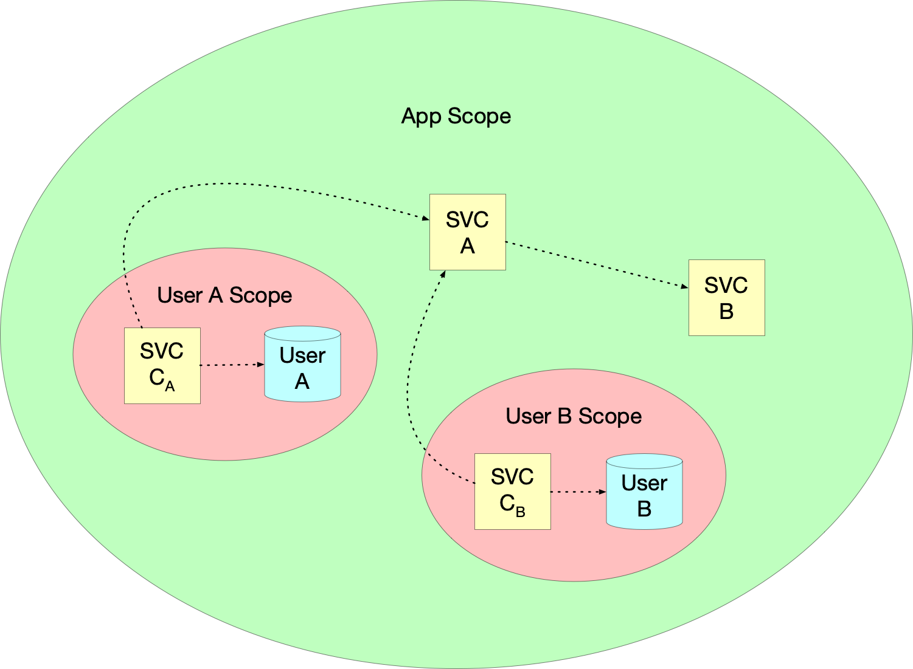

# ServiceLocator

Simple service locator infrastructure. Pass around protocols backed by these locators to your view
controllers and coordinators to simplify dependency injection.

## Basic Example

```swift
/// Services available in the app scope.
protocol AppServices {
  var myAppScopedService: MyAppScopedServiceProtocol { get }
  var otherAppScopedService: OtherAppScopedServiceProtocol { get }
}

/// Production implementation of `AppServices`.
class ProdAppServices: ServiceLocator, AppServices {
  var myAppScopedService: MyAppScopedServiceProtocol {
    singleton { MyAppScopedServiceImpl(other: otherAppScopedService) }
  }
  …
  var otherAppScopedService: OtherAppScopedServiceProtocol {
    singleton { OtherAppScopedServiceImpl() }
  }
}
```

## Scopes

Compose service locators to provide isolation amongst domains.



### Broad Rules

* Parent scopes **must not** access services from child scopes
* Child scopes **can** access services from parent scopes
* Child scopes **must not** access services/data from sibling scopes

### Example

```swift
/// Services available in the user scope.
protocol UserServices {
  var myUserScopedService: MyUserScopedServiceProtocol { get }
}

/// Production implementation of `UserServices`.
class ProdUserServices: ChildServiceLocator<ProdAppServices>, UserServices {
  var myUserScopedService: MyUserScopedServiceProtocol {
    singleton {
      UserScopedServiceImplementation(parentService: parent.myAppScopedService)
    }
  }
}
```
